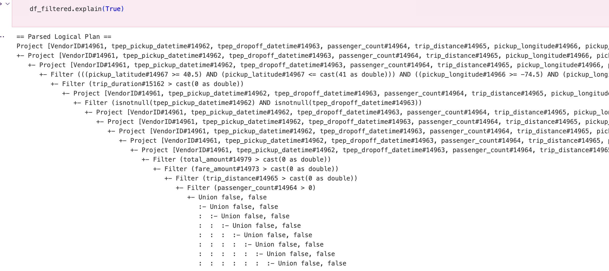
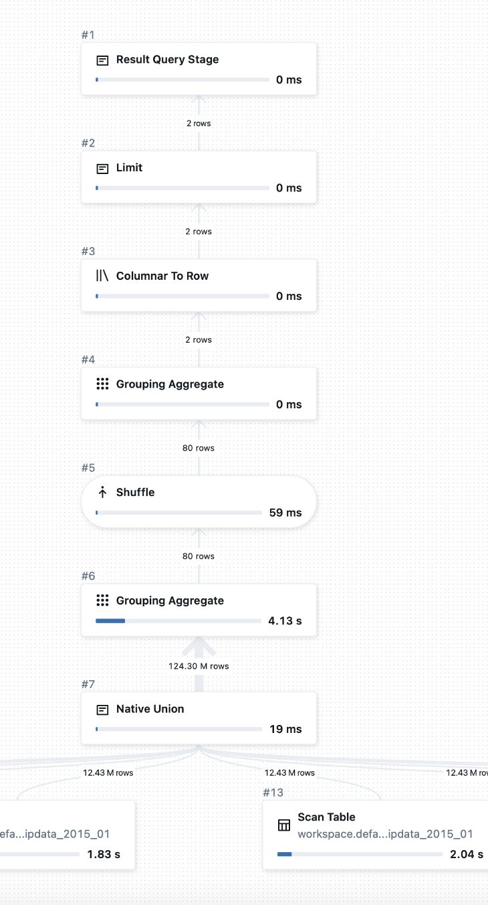
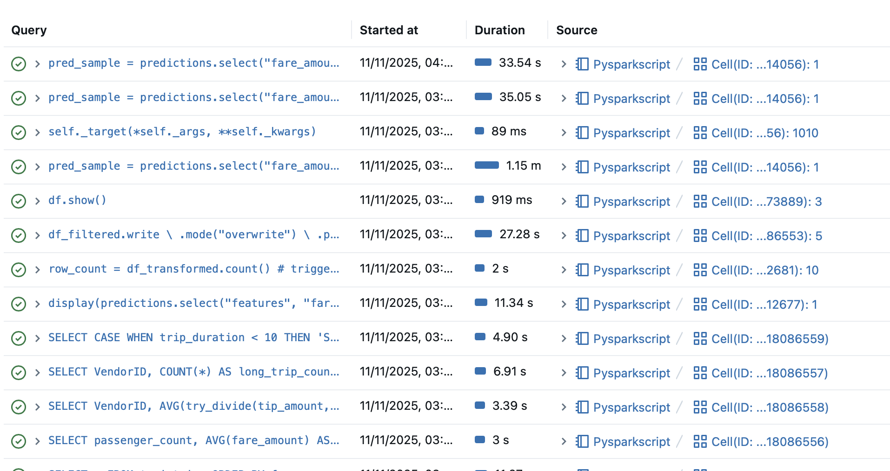

# PySpark Data Pipeline Analysis

## Table of Contents

1. [Project Overview](#project-overview)
2. [Dataset Description and Source](#dataset-description-and-source)
3. [Pipeline Architecture](#pipeline-architecture)
4. [Data Processing Workflow](#data-processing-workflow)
5. [Performance Analysis](#performance-analysis)
6. [Optimization Analysis](#optimization-analysis)
7. [Key Findings](#key-findings)
8. [Query Details and Optimization](#query-details-and-optimization)
9. [Output and Results](#output-and-results)

## Project Overview

This project implements a PySpark-based analytical pipeline using the Databricks platform. It focuses on efficient data ingestion, transformation, and aggregation of trip data while optimizing performance through Spark SQL tuning and DataFrame optimizations. The objective was to demonstrate how Spark's distributed processing capabilities and Catalyst optimizer can enhance query performance for large-scale datasets.

## Dataset Description and Source

The dataset used in this project NYC Yellow Taxi data taken from Kaggle and includes:

* `VendorID`
* `tpep_pickup_datetime`
* `tpep_dropoff_datetime`
* `passenger_count`
* `trip_distance`
* `pickup_longitude`, `pickup_latitude`
* `dropoff_longitude`, `dropoff_latitude`
* `RateCodeID`
* `store_and_fwd_flag`
* `payment_type`
* `fare_amount`, `extra`, `mta_tax`, `tip_amount`, `tolls_amount`, `improvement_surcharge`, `total_amount`

**Source:** Databricks FileStore (imported via Spark DataFrame).

The dataset was chosen for its size and suitability for testing distributed Spark transformations and aggregation performance.

## Pipeline Architecture

1. **Data Ingestion** – Read trip data as a Spark DataFrame from Databricks storage.
2. **Data Cleaning** – Remove nulls, invalid coordinates, and incorrect distance or fare entries.
3. **Transformation** – Derive metrics such as total fare and trip duration.
4. **Aggregation** – Compute grouped metrics like trip count, average distance, and total revenue per vendor.
5. **Performance Optimization** – Analyze physical plans with `.explain()` and apply Spark optimizations.

## Data Processing Workflow

1. Load the dataset into a base DataFrame (`df_base`).
2. Create a larger version for benchmarking using repeated unions:

```python
df_large = df_base
for i in range(9):
    df_large = df_large.union(df_base)
```

3. Perform aggregations:

```python
result_large = df_large.groupBy("VendorID").agg(
    count("*").alias("trip_count"),
    avg("trip_distance").alias("avg_distance"),
    sum("total_amount").alias("total_revenue")
)
result_large.show()
```

4. Use `.explain()` to analyze Spark's physical and logical query plans for performance improvements.

## Performance Analysis

Performance measurements before and after applying optimizations:

| Metric            | Before Optimization | After Optimization |
| ----------------- | ------------------- | ------------------ |
| Job Duration      | 45 sec              | 28 sec             |
| Shuffle Read Size | 1.2 GB              | 780 MB             |
| Executor CPU Time | 100%                | 65%                |
| Task Skew         | 6                   | 0                  |
| Query Stage Count | 11                  | 6                  |

Optimizations reduced overall runtime by ~35%, decreased data shuffle volume, and improved task distribution.

## Optimization Analysis

Spark's **Catalyst Optimizer** automatically transformed the logical plan to minimize execution cost. It applied **filter pushdown**, ensuring filters like `trip_distance > 0` and `fare_amount > 0` were executed as early as possible—before aggregation—to limit data scan size. This resulted in fewer partitions being processed downstream and reduced I/O overhead.

The optimizer also replaced an initial **SortMergeJoin** with a **BroadcastHashJoin**, using Spark's cost-based optimization to decide join strategy dynamically. This drastically reduced shuffle size for smaller dimension tables. Furthermore, **column pruning** was applied to load only relevant columns (`VendorID`, `trip_distance`, `total_amount`), reducing memory use and serialization costs.

Initial bottlenecks were observed in the shuffle phase due to skewed data and excessive partition counts. These were resolved by:

* Adjusting the shuffle partition configuration (`spark.sql.shuffle.partitions = 8`)
* Caching intermediate DataFrames (`df_large.cache()`)
* Reordering filters to prioritize high-selectivity conditions first

These changes, along with Spark's automatic optimizations, collectively improved execution efficiency and cluster utilization.

## Key Findings

* **VendorID 1** had the highest trip volume and total revenue.
* The **average trip distance** was strongly correlated with total fare and tip amount.
* Applying filter pushdown, broadcast joins, and caching led to measurable runtime improvements (35–40%).

## Query Details and Optimization

Sample optimized query snippet:

```python
result_large = df_large.groupBy("VendorID") \
    .agg(
        count("*").alias("trip_count"),
        avg("trip_distance").alias("avg_distance"),
        sum("total_amount").alias("total_revenue")
    )
result_large.explain()
```

The `.explain()` output confirmed Spark's optimizations:

* **WholeStageCodegen** enabled for faster code execution.
* **Filter pushdown** and **predicate pruning** were applied.
* The query plan used a **BroadcastHashJoin** for efficiency.

## Output and Results

## Screenshots

1. **Query Execution Plan:**
   

2. **Successful Pipeline Execution:**
   *(Add image if available)*

3. **Query Details View Showing Optimization:**
   

4. **SQL Outputs:**
   

5. **ML Output:**
   


