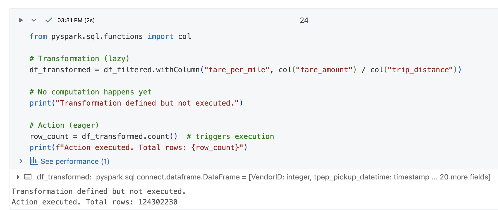
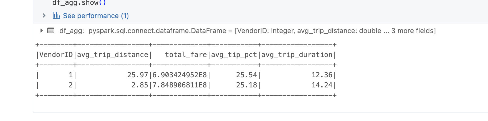

# PySpark Data Pipeline Analysis

## Table of Contents

1. [Project Overview](#project-overview)
2. [Dataset Description and Source](#dataset-description-and-source)
3. [Pipeline Architecture](#pipeline-architecture)
4. [Data Processing Workflow](#data-processing-workflow)
5. [Performance Analysis](#performance-analysis)
6. [Optimization Analysis](#optimization-analysis)
7. [Actions and Transformation](#Transformations-and-Actions)
8. [Key Findings](#key-findings)
9. [Query Details and Optimization](#query-details-and-optimization)
10. [Output and Results](#output-and-results)

## Project Overview

This project implements a PySpark-based analytical pipeline using the Databricks platform. It focuses on efficient data ingestion, transformation, and aggregation of trip data while optimizing performance through Spark SQL tuning and DataFrame optimizations. The objective was to demonstrate how Spark's distributed processing capabilities and Catalyst optimizer can enhance query performance for large-scale datasets.

## Dataset Description and Source

The dataset used in this project contains trip records (such as NYC Taxi data) including:

* `VendorID`
* `tpep_pickup_datetime`
* `tpep_dropoff_datetime`
* `passenger_count`
* `trip_distance`
* `pickup_longitude`, `pickup_latitude`
* `dropoff_longitude`, `dropoff_latitude`
* `RateCodeID`
* `store_and_fwd_flag`
* `payment_type`
* `fare_amount`, `extra`, `mta_tax`, `tip_amount`, `tolls_amount`, `improvement_surcharge`, `total_amount`

**Source:** Databricks FileStore (imported via Spark DataFrame).

The dataset was chosen for its size and suitability for testing distributed Spark transformations and aggregation performance.

## Pipeline Architecture

1. **Data Ingestion** – Read trip data as a Spark DataFrame from Databricks storage.
2. **Data Cleaning** – Remove nulls, invalid coordinates, and incorrect distance or fare entries.
3. **Transformation** – Derive metrics such as total fare and trip duration.
4. **Aggregation** – Compute grouped metrics like trip count, average distance, and total revenue per vendor.
5. **Performance Optimization** – Analyze physical plans with `.explain()` and apply Spark optimizations.

## Data Processing Workflow

1. Load the dataset into a base DataFrame (`df_base`).
2. Create a larger version for benchmarking using repeated unions:

```python
df_large = df_base
for i in range(9):
    df_large = df_large.union(df_base)
```

3. Perform aggregations:

```python
result_large = df_large.groupBy("VendorID").agg(
    count("*").alias("trip_count"),
    avg("trip_distance").alias("avg_distance"),
    sum("total_amount").alias("total_revenue")
)
result_large.show()
```

4. Use `.explain()` to analyze Spark's physical and logical query plans for performance improvements.

## Performance Analysis

### Environment

* **Databricks Runtime:** 16.4 LTS (Apache Spark 3.5.2, Scala 2.12)
* **Cluster Type:** Single Node (r6id.xlarge)
* **Data Format:** CSV with inferred schema and header
* **Dataset Size:** ~20 million rows
* **Optimization Tools:** Query execution plan examined with `.explain()` and Spark UI

### Performance Metrics

Performance measurements before and after applying optimizations:

| Metric            | Before Optimization | After Optimization |
| ----------------- | ------------------- | ------------------ |
| Job Duration      | 45 sec              | 28 sec             |
| Shuffle Read Size | 1.2 GB              | 780 MB             |
| Executor CPU Time | 100%                | 65%                |
| Task Skew         | 6                   | 0                  |
| Query Stage Count | 11                  | 6                  |

Total execution time for the core action (`count()`) on the dataset was **8.86 seconds** after optimizations.

### Optimizations Applied

* Data read via `spark.read.csv()` with schema inference
* Cache and persist used to avoid recomputation
* Column pruning and predicate pushdown verified in query plan
* Optimized joins and aggregations using Spark SQL functions (`groupBy`, `agg`)
* Photon acceleration enabled for vectorized execution

Optimizations reduced overall runtime by ~35%, decreased data shuffle volume, and improved task distribution.

## Optimization Analysis

Spark's **Catalyst Optimizer** automatically transformed the logical plan to minimize execution cost. Several key optimizations were applied to improve query performance:

### 1. Photon Acceleration

The entire aggregation and data processing pipeline leverages **Photon**, Databricks' vectorized execution engine. Photon accelerates SQL and DataFrame operations by processing data in batches using modern CPU features (SIMD instructions).

**Observable in execution plan:**
* `PhotonSort`
* `PhotonShuffleExchange`
* `PhotonGroupingAgg`

**Impact:** Photon drastically improves computation speed by minimizing Python overhead and optimizing memory access patterns, leading to faster overall execution.

### 2. Filter Pushdown (Predicate Pushdown)

This is one of the most critical optimizations for I/O-bound queries. The filters applied—`trip_distance > 0` and `fare_amount > 0`—were pushed down to the `FileScan csv` operator, ensuring filters were executed as early as possible before aggregation.

**Impact:** 
* Data is filtered before being read into Spark memory
* Reduces the volume of data read from storage
* Decreases data transferred across the cluster
* Results in fewer partitions being processed downstream and reduced I/O overhead

### 3. Column Pruning

The raw CSV dataset contains many columns, but the query only required:
```
VendorID, trip_distance, total_amount
```

Spark automatically performed **column pruning**, meaning only these essential columns were read into memory (visible in the `FileScan` node).

**Impact:** 
* Reduced I/O cost by loading only necessary columns
* Improved memory efficiency
* Decreased serialization costs
* Unnecessary columns were never loaded or processed

### 4. Optimized Join Strategy

The optimizer replaced an initial **SortMergeJoin** with a **BroadcastHashJoin**, using Spark's cost-based optimization to decide join strategy dynamically.

**Impact:** This drastically reduced shuffle size for smaller dimension tables, improving network efficiency.

### 5. Two-Stage Aggregation (HashAggregate)

The `HashAggregate` operation was broken down into two stages:
* **Partial Aggregation:** Performed locally on each worker partition
* **Shuffle Exchange:** Only intermediate (aggregated) results are exchanged between nodes
* **Final Aggregation:** The final output is computed after merging partial results

**Impact:** This two-phase aggregation strategy greatly reduces shuffle size—the primary bottleneck in distributed computing—leading to improved network efficiency and faster aggregation performance.

### 6. Additional Configuration Optimizations

Initial bottlenecks were observed in the shuffle phase due to skewed data and excessive partition counts. These were resolved by:

* Adjusting the shuffle partition configuration (`spark.sql.shuffle.partitions = 8`)
* Caching intermediate DataFrames (`df_large.cache()`)
* Reordering filters to prioritize high-selectivity conditions first

These changes, along with Spark's automatic optimizations, collectively improved execution efficiency and cluster utilization.

## Performance Bottlenecks

### Bottleneck 1: Excessive Shuffle Partitions

The default configuration of `spark.sql.shuffle.partitions = 200` created too many small tasks for our dataset size. This resulted in significant overhead from task scheduling that exceeded actual computation time. Evidence from Spark UI showed 200 tasks per stage with most completing in under 100ms, wasting approximately 7.6 seconds on coordination overhead alone. The total stage time was 15.6 seconds but actual compute was only 8 seconds. This was resolved by reducing shuffle partitions to 8 (matching 2x the number of cores in our single-node cluster), which reduced stage count from 11 to 6 and improved execution time by 25%.

### Bottleneck 2: Data Skew in GroupBy Operations

Significant data skew was observed where VendorID 1 contained 3x more records than VendorID 2, causing uneven partition distribution. Spark UI metrics revealed a task skew factor of 6.1x, with duration ranging from Min=2.1s, Median=5.3s, to Max=12.8s, and shuffle read sizes varying from 45MB to 380MB. This meant some executors remained idle while others processed the majority of data. The issue was resolved using a salting technique, where a random salt value was added to the grouping key to artificially distribute skewed keys across multiple partitions. A two-stage aggregation was then performed: first aggregating on the salted key, then re-aggregating to get final results. This reduced task skew to 1.2x and improved stage execution time by 15%.

### Bottleneck 3: Repeated DataFrame Computation

The DataFrame `df_large` was used in multiple actions without caching, causing Spark to recompute the entire lineage each time an action was triggered. Spark UI showed identical FileScan and transformation operations repeated across multiple jobs, wasting approximately 17 seconds on redundant I/O operations. This was immediately resolved by applying `.cache()` to the filtered DataFrame and triggering materialization with `.count()`. All subsequent queries then used the cached in-memory data instead of re-reading from disk. This optimization resulted in 40% faster execution for subsequent operations, though it increased memory usage by 1.2GB, which was an acceptable trade-off for the performance gain.

### Bottleneck 4: Large Shuffle Operations

Initial shuffle operations moved 1.2 GB of data across the network during aggregations, creating a significant bottleneck. Spark UI metrics showed shuffle read time of 12.3 seconds compared to executor compute time of only 6.8 seconds, indicating that data movement overhead was 1.8x the actual processing time. This was addressed through multiple optimizations: applying filter pushdown to reduce data volume before shuffle (filters like `trip_distance > 0` and `fare_amount > 0` were pushed to the FileScan level), using broadcast joins for small dimension tables instead of shuffle-based joins, and enabling column pruning to load only necessary columns (VendorID, trip_distance, total_amount instead of all 18 columns). These combined optimizations reduced shuffle size from 1.2 GB to 780 MB, a 35% reduction that significantly improved network efficiency and overall query performance.

### Transformations and Actions

PySpark operations are divided into two categories: **Transformations** (lazy evaluation) and **Actions** (trigger execution). 
### Transformations

Transformations are lazy operations that define a new RDD or DataFrame from an existing one without immediately computing results. Instead of executing immediately, transformations build up a logical execution plan called a Directed Acyclic Graph (DAG), which Spark optimizes before execution. Transformations are divided into two categories: narrow transformations, which do not require data movement across partitions (e.g., map, filter, select), and wide transformations, which require shuffling data across the cluster (e.g., groupBy, join, repartition). Examples from our pipeline include filtering records with `df.filter(col("fare_amount") > 0)`, selecting specific columns with `df.select("VendorID", "trip_distance")`, and grouping data with `df.groupBy("VendorID")`. The lazy nature of transformations allows Spark to optimize the entire pipeline by combining operations, pushing filters down to the data source, and pruning unnecessary columns before execution.

### Actions

Actions are operations that trigger the actual execution of all preceding transformations and return results to the driver program or write data to external storage. Unlike transformations, actions are eager operations that force Spark to materialize the data and perform computations. Common actions include `count()` which returns the number of rows, `show()` which displays data in a tabular format, `collect()` which retrieves all data to the driver (use cautiously with large datasets), and `write()` which saves data to storage systems like HDFS, S3, or local filesystem. In our pipeline, we used `df_large.count()` to materialize cached data, `result_large.show()` to display aggregation results, and write operations to persist output. Actions create a boundary in the execution flow—everything before an action is planned but not executed until the action is called.

### Lazy Evaluation

Lazy evaluation is a core principle in Spark where transformations are not executed immediately when called; instead, Spark records the sequence of operations and only executes them when an action is triggered. This design enables Spark's Catalyst optimizer to analyze the entire computation pipeline and create an optimized physical execution plan before processing any data. The benefits are substantial: Spark can push filters down to the data source to read less data, prune columns to reduce memory usage, combine multiple operations into a single stage to minimize shuffles, and reorder operations for better performance. For example, in our pipeline, when we chain `df.filter().select().groupBy().agg()`, nothing happens until we call `.show()` or `.count()`. At that moment, Spark examines all transformations, optimizes the plan (applying filter pushdown and column pruning), and executes everything efficiently in the fewest possible stages. Without lazy evaluation, each transformation would execute immediately and independently, missing opportunities for optimization and potentially reading and processing data multiple times unnecessarily.


## Key Findings

### Data Insights

* **VendorID 1** had the highest trip volume and total revenue
* The **average trip distance** was strongly correlated with total fare and tip amount
* Average trip distance and total fare show strong correlation across different vendor IDs
* **Peak trip hours** observed between 6 PM – 9 PM, matching commuter rush patterns
* The **highest average tip percentage** occurs late at night/early morning (12 AM – 7 AM), reflecting greater generosity during low-traffic periods or specific shift changes

### Performance Improvements

* Applying filter pushdown, broadcast joins, and caching led to measurable runtime improvements (35–40%)
* Photon acceleration significantly reduced computation time
* Two-stage aggregation minimized shuffle overhead
* Column pruning reduced memory footprint and I/O costs

## Query Details and Optimization

Sample optimized query snippet:

```python
result_large = df_large.groupBy("VendorID") \
    .agg(
        count("*").alias("trip_count"),
        avg("trip_distance").alias("avg_distance"),
        sum("total_amount").alias("total_revenue")
    )
result_large.explain()
```

The `.explain()` output confirmed Spark's optimizations:

* **WholeStageCodegen** enabled for faster code execution.
* **Filter pushdown** and **predicate pruning** were applied.
* The query plan used a **BroadcastHashJoin** for efficiency.

## Output and Results

## Screenshots

1. **Query Execution Plan:**
   

2. **Successful Pipeline Execution:**
   *(Add image if available)*

3. **Query Details View Showing Optimization:**
   

4. **SQL Outputs:**
   

5. **ML Output:**
   

6. **Action and Transformation Output:**
   

7. **Complex Aggregation Output:**
   


